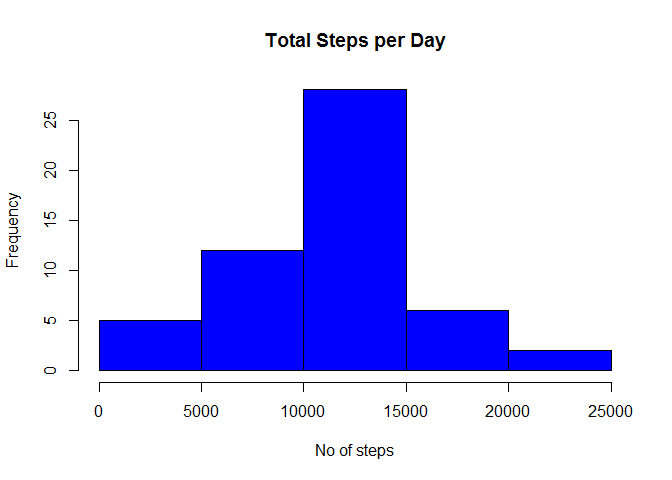
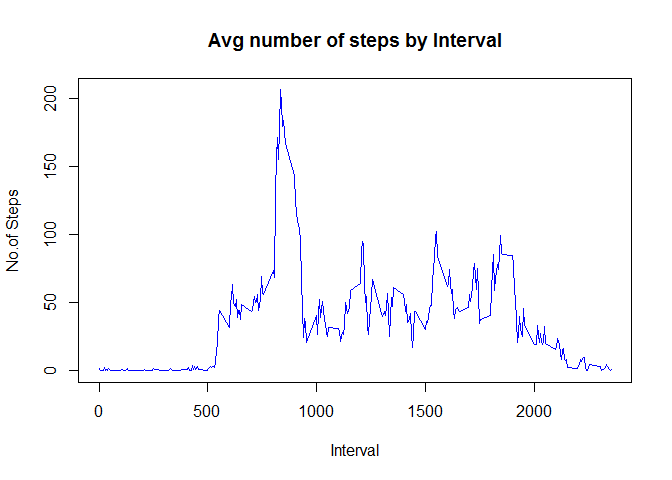
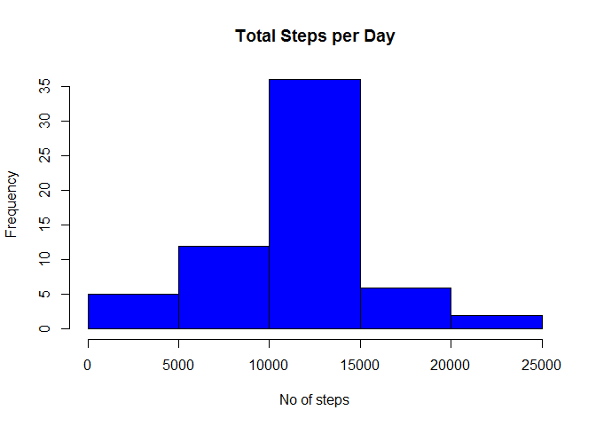
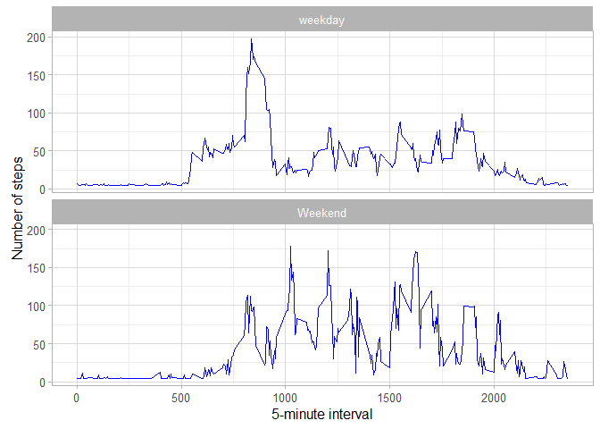

# Reproducible Research: Peer Assessment 1


## Loading and preprocessing the data

```r
Activity=read.csv("activity//activity.csv", header=T)

## What is mean total number of steps taken per day?

##1.Calculate the total number of steps taken per day
Totalstep <-aggregate(steps ~date,Activity,sum)

##Make a histogram of the total number of steps taken each day

hist(Totalstep$steps,main = "Total Steps per Day",col = "blue", xlab = "No of steps")
```



```r
##Calculate and report the mean and median total number of steps taken per day

smean<-mean(Totalstep$steps)
smedian <-median(Totalstep$steps)
```
The Mean is 

```
## [1] 10766.19
```

The Median is 

```
## [1] 10765
```


## What is the average daily activity pattern?


```r
Interval<- aggregate(steps ~interval,Activity,mean)

plot(Interval,type="l",col="blue",xlab="Interval",ylab ="No.of Steps",main ="Avg number of steps by Interval")
```



```r
## 5-minute interval, on average across all the days in the dataset, contains the maximum number of steps?
Max_Interval<-Interval[which.max(Interval$steps),1]
```
Max Step Interval

```
## [1] 835
```
## Imputing missing values

```r
##Total number of rows with NAs
Missing_Value<-is.na(Activity)

Total_na<-sum(Missing_Value)
```
Total number of rows with NAs

```
## [1] 2304
```

```r
library(Hmisc)
```

```
## Warning: package 'Hmisc' was built under R version 3.2.3
```

```
## Loading required package: lattice
```

```
## Loading required package: survival
```

```
## Loading required package: Formula
```

```
## Warning: package 'Formula' was built under R version 3.2.3
```

```
## Loading required package: ggplot2
```

```
## Warning: package 'ggplot2' was built under R version 3.2.3
```

```
## 
## Attaching package: 'Hmisc'
```

```
## The following objects are masked from 'package:base':
## 
##     format.pval, round.POSIXt, trunc.POSIXt, units
```

```r
## filling in all of the missing values in the dataset with Mean
Activity_New<-Activity
Activity_New$steps<-impute(Activity_New$steps,fun=mean)

Totalsteps <-aggregate(steps ~date,Activity_New,sum)

##Make a histogram of the total number of steps taken each day

hist(Totalsteps$steps,main = "Total Steps per Day",col = "blue", xlab = "No of steps")
```



```r
##Calculate and report the mean and median total number of steps taken per day

smean1<-mean(Totalsteps$steps)
smedian1 <-median(Totalsteps$steps)

Step_Diff<-sum(Totalsteps$steps)-sum(Totalstep$steps)
Mean_diff<-smean1-smean
Median_diff<-smedian1-smedian
```
The Mean is 

```
## [1] 10766.19
```
The Median is 

```
## [1] 10766.19
```
The Mean Diff is 

```
## [1] 0
```
The Median Diff is 

```
## [1] 1.188679
```
The Step Diff is 

```
## [1] 86129.51
```

## Are there differences in activity patterns between weekdays and weekends?

```r
##1.Create a new factor variable in the dataset with two levels - "weekday" and "weekend"

Activity_New$WeekDay <- ifelse(weekdays(as.Date(Activity_New$date))==c("Sunday"),"Weekend","weekday") 

##2.Make a panel plot containing a time series plot (i.e. type = "l") of the 5-minute interval (x-axis) and the average number of steps taken, averaged across all weekday days or weekend days (y-axis). 

Interval_per_Day<- aggregate(steps ~WeekDay+interval,Activity_New,mean)

ggplot(Interval_per_Day,aes(interval,steps))+
geom_line(color="blue")+
facet_wrap(~WeekDay,nrow=2,ncol=1)+
xlab("5-minute interval")+
ylab("Number of steps")+
theme_light()
```



